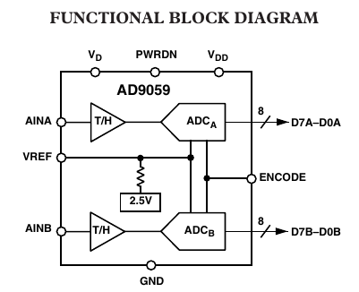
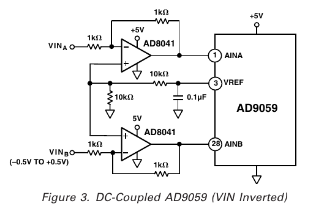

# DSO-6021 Development Notes

The idea came up during a
[discussion](https://github.com/OpenHantek/OpenHantek6022/issues/132#issuecomment-737118635)
on OpenHantek6022.

## Digital Backend
The easiest solution for this redesign would be to use a cheap EzUSB board
as digital backend and build a separate analog front end.
It will run mostly without SW change, only the gain and AC/DC switching
must move from port C and E to port A, which would lead to a new firmware.
We need:
* IFCLK out
* CTL2 out
* Port B
  * FD0..7 in - 8 x Data CH1
* Port D
  * FD 8..15 in - 8 x Data CH2
* Port A
  * PA7 - calibration out
  * PA6 - AC CH1 out
  * PA5..4 - gain CH1 out
  * PA3 - LED green out
  * PA2 - AC CH0 out
  * PA1..0 - gain CH1 out

## EzUSB Board

These simple boards are sold as cheap (S*lae compatible) logic analyzers.
They consist mainly of an EzUSB chip with 24 MHz quartz, a 24C128 I2C EEPROM,
an USB connector and two 2x10 header pin connectors.
The pinning is mostly standard, but take care of small differencies (*italic*)!
The necessary connections are marked in **bold**.

### Geeetech EzUSB Board Connectors

| left     | left      || right     | right    |
|----------|-----------||-----------|----------|
| **PD5**  | **PD6**   ||  **PD4**  | **PD3**  |
| **PD7**  | **GND**   ||  **PD2**  | **PD1**  |
| CLK      | **GND**   ||  **PD0**  | **PA7**  |
| *RDY1*   | *RDY0*    ||  **PA6**  | **PA5**  |
| **GND**  | *3V3*     ||  **PA4**  | **PA3**  |
| **GND**  | **IFCLK** ||  **PA2**  | **PA1**  |
| SCL      | SDA       ||  **PA0**  | **CTL2** |
| **PB0**  | **PB1**   ||  CTL1     | CTL0     |
| **PB2**  | **PB3**   ||  **PB7**  | **PB6**  |
| *GND*    | **3V3**   ||  **PB5**  | **PB4**  |

### LCsoft EzUSB Board Connectors

| left     | left      || right     | right    |
| ---------|-----------||-----------|----------|
| **PD5**  | **PD6**   ||  **PD4**  | **PD3**  |
| **PD7**  | **GND**   ||  **PD2**  | **PD1**  |
| CLK      | **GND**   ||  **PD0**  | **PA7**  |
| *RDY0*   | *RDY1*    ||  **PA6**  | **PA5**  |
| **GND**  | *GND*     ||  **PA4**  | **PA3**  |
| **GND**  | **IFCLK** ||  **PA2**  | **PA1**  |
| SCL      | SDA       ||  **PA0**  | **CTL2** |
| **PB0**  | **PB1**   ||  CTL1     | CTL0     |
| **PB2**  | **PB3**   ||  **PB7**  | **PB6**  |
| *3V3*    | **3V3**   ||  **PB5**  | **PB4**  |

## EzUSB to ADC Connection
The AD9059 (Dual 8-Bit, 60 MSPS A/D Converter) is clocked by the signal IFCLK
for high speed sampling (30 MS/s) and CTL2 for all lower sample rates.
The unused clock signal is tristated, so both clock sources can be tied together:

    IFCLK --\
             +----> ENCODE
    CTL2 ---/

The sampled digital 8bit values of both channels are directly connected to the EzUSB:

            8
    DA =====/=====> PB
    
            8
    DB =====/=====> PD

## Analog to Digital Conversion
The ADC inputs are fed by two AD8041 (160 MHz op-amps) that provide the necessary level shifting

An input voltage range of -0.5 V .. +0.5 V will be translated
to an inverted voltage range at the ADC input of 3.0 V .. 2.0 V.
The ADC converts this range to a (binary offset) digital value of 0xFF .. 0x00

## Analog Frontend
The redesign gives the opportunity to implement better gain steps
than the 4 original ones (1,2,5,10),
e.g. 0.5, 2, 10, 50
or even 0.1, 1, 10, 100 with better resolution in the low level while also allowing
to measure up to 10 .. 20 V directly without clipping.

t.b.d.

## Setup New Firmware & New Oscilloscope Model
1. Firmware - Project [Hantek6022API](https://github.com/Ho-Ro/Hantek6022API)
    1. Add a new directory DSO6021 under [Firmware](https://github.com/Ho-Ro/Hantek6022API/tree/master/PyHT6022/Firmware), e.g. copy [DSO6022BL](https://github.com/Ho-Ro/Hantek6022API/tree/master/PyHT6022/Firmware/DSO6022BL) and adapt it accordingly.
    2. Add this directory to the top level [Makefile](https://github.com/Ho-Ro/Hantek6022API/blob/master/Makefile).
    3. Add the new device ID (`0x6021`) to the file [60-hantek6022api.rules](https://github.com/Ho-Ro/Hantek6022API/blob/master/60-hantek6022api.rules).
    4. Add the new firmware and new device ID to [setup.py](https://github.com/Ho-Ro/Hantek6022API/blob/master/setup.py), [PyHT6022/LibUsbScope.py](https://github.com/Ho-Ro/Hantek6022API/blob/master/PyHT6022/LibUsbScope.py) and [PyHT6022/Firmware/__init__.py](https://github.com/Ho-Ro/Hantek6022API/blob/master/PyHT6022/Firmware/__init__.py).
    5. Execute `make`, `make deb` and `make debinstall` to build and install the new package (on my Debian system).
    6. Execute `make xfer` to copy the firmware over to the project [OpenHantek6022](https://github.com/OpenHantek/OpenHantek6022).
2. Oscilloscope - Project [OpenHantek6022](https://github.com/OpenHantek/OpenHantek6022)
    1. Add the DSO6021-firmware.hex file to [firmwares.qrc](https://github.com/OpenHantek/OpenHantek6022/blob/master/openhantek/res/firmwares.qrc).
    2. Create new `modelDSO6021.h` and `modelDSO6021.cpp` under [models](https://github.com/OpenHantek/OpenHantek6022/tree/master/openhantek/src/hantekdso/models), e.g. copy an existing model and adapt it accordingly.
    3. Add the new device ID (`0x6021`) to the file [60-openhantek.rules](https://github.com/OpenHantek/OpenHantek6022/blob/master/utils/udev_rules/60-openhantek.rules).
    4. Enter the directory `build` and execute `make -j4 && openhantek/OpenHantek` to test the software.
    5. Execute `rm -f packages/* && make -j4 package` to build a debian package that can be installed and removed cleanly.
