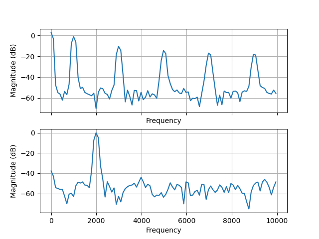
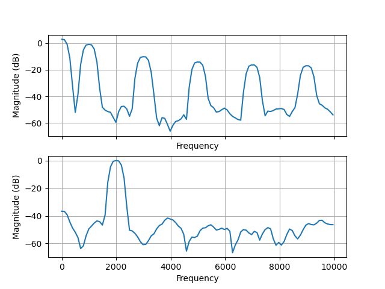
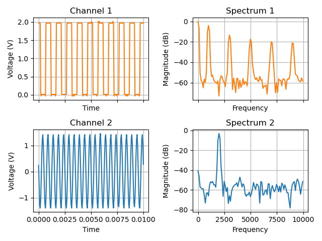

# List of examples programs

## Calibration

### `calibrate_6022.py`
```
usage: calibrate_6022.py [-h] [-c] [-e] [-g]

Measure offset and gain calibration values

options:
  -h, --help           show this help message and exit
  -c, --create_config  create a config file
  -e, --eeprom         store calibration values in eeprom
  -g, --measure_gain   interactively measure gain (as well as offset)
```
## Measure

### `set_cal_out_freq_6022.py`
```
usage: set_cal_out_freq_6022.py FREQ
with 32 <= FREQ <= 100000
```
Sets the calibration output frequency between 32 Hz and 100 kHz.

### `capture_6022.py`
```
usage: capture_6022.py [-h] [-d [DOWNSAMPLE]] [-g] [-o OUTFILE] [-r RATE] [-t TIME] [-x CH1] [-y CH2]

Capture data from both channels of Hantek6022

options:
  -h, --help            show this help message and exit
  -d [DOWNSAMPLE], --downsample [DOWNSAMPLE]
                        downsample 256 x DOWNSAMPLE
  -g, --german          use comma as decimal separator
  -o OUTFILE, --outfile OUTFILE
                        write the data into OUTFILE (default: stdout)
  -r RATE, --rate RATE  sample rate in kS/s (20, 32, 50, 64, 100, 128, 200, default: 20)
  -t TIME, --time TIME  capture time in seconds (default: 1.0)
  -x CH1, --ch1 CH1     gain of channel 1 (1, 2, 5, 10, default: 1)
  -y CH2, --ch2 CH2     gain of channel 2 (1, 2, 5, 10, default: 1)
```

## Visualise captured values

### `fft_from_capture_6022.py`
```
usage: fft_from_capture_6022.py [-h] [-i INFILE] [-f | -n] [-x]

Plot FFT of output from capture_6022.py, use hann windowing as default

options:
  -h, --help            show this help message and exit
  -i INFILE, --infile INFILE
                        read the data from INFILE, (default: stdin)
  -f, --flat_top        use flat top window
  -n, --no_window       use no window
  -x, --xkcd            plot in XKCD style :)
```
#### Hann window

#### Flat top window


### `plot_from_capture_6022.py`
```
usage: plot_from_capture_6022.py [-h] [-i INFILE] [-c CHANNEL] [-s [MAX_FREQ]] [-x]

Plot output of capture_6022.py over time

options:
  -h, --help            show this help message and exit
  -i INFILE, --infile INFILE
                        read the data from INFILE (default: stdin)
  -c CHANNEL, --channel CHANNEL
                        show only CH1 or CH2, default: show both)
  -s [MAX_FREQ], --spectrum [MAX_FREQ]
                        display the spectrum of the samples, optional up to MAX_FREQ
  -x, --xkcd            plot in XKCD style :)
```



## Test and development support

### `upload_6022_firmware_from_hex.py`
```
usage: upload_6022_firmware_from_hex.py HEXFILE
```
Uploads firmware from intel hex file to device

### `upload_6022_firmware.py`
Uploads standard firmware to device - deprecated, will be replaced by `upload_firmware_6022.py`

### `upload_firmware_6022.py`
```
usage: upload_firmware_6022.py [-h] [-V VID] [-P PID] [--be | --bl]

Upload firmware to Hantek6022 devices with different VID:PID

options:
  -h, --help         show this help message and exit
  -V VID, --VID VID  set vendor id (hex)
  -P PID, --PID PID  set product id (hex)
  --be, --6022be     use DSO-6022BE firmware
  --bl, --6022bl     use DSO-6022BL firmware
```

This tool can be used to upload the firmware to devices with
[damaged EEPROM content](https://github.com/Ho-Ro/Hantek6022API/discussions/28).
These devices enumerate as Cypress development kit with VID:PID 04b4:8613.

```
$ lsusb | grep Cypress
Bus 002 Device 021: ID 04b4:8613 Cypress Semiconductor Corp. CY7C68013 EZ-USB FX2 USB 2.0 Development Kit

$ ./upload_firmware_6022.py --VID 04b4 --PID 8613 --6022be
upload DSO-6022BE firmware
FW version 0x210
Serial number CF81BA1F3532

$ lsusb | grep Hantek
Bus 002 Device 022: ID 04b5:6022 ROHM LSI Systems USA, LLC Hantek DSO-6022BE
```

### `reset_eeprom_6022.py`
**Warning:** this program will delete all calibration values from EEPROM - use with care!
